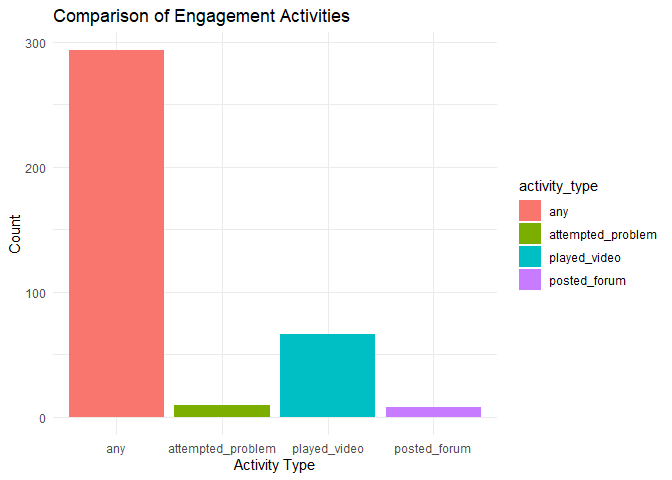
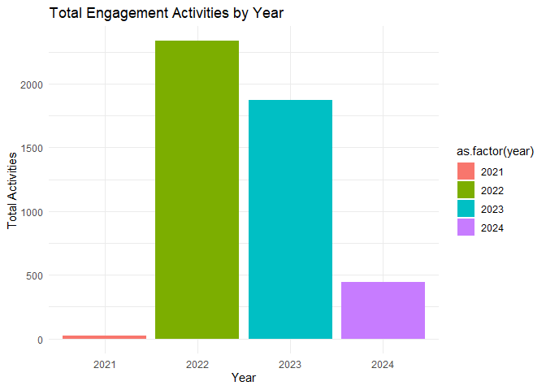
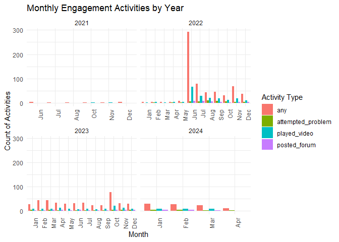
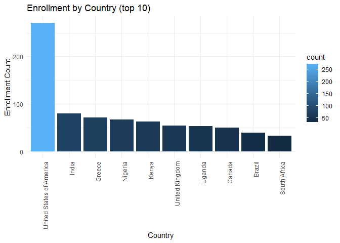

inspire_data
================
Sanika Sule
2024-05-01

``` r
library(tidyverse)
```

    ## Warning: package 'readr' was built under R version 4.3.2

    ## Warning: package 'stringr' was built under R version 4.3.3

    ## ── Attaching core tidyverse packages ──────────────────────── tidyverse 2.0.0 ──
    ## ✔ dplyr     1.1.3     ✔ readr     2.1.4
    ## ✔ forcats   1.0.0     ✔ stringr   1.5.1
    ## ✔ ggplot2   3.4.3     ✔ tibble    3.2.1
    ## ✔ lubridate 1.9.2     ✔ tidyr     1.3.0
    ## ✔ purrr     1.0.2     
    ## ── Conflicts ────────────────────────────────────────── tidyverse_conflicts() ──
    ## ✖ dplyr::filter() masks stats::filter()
    ## ✖ dplyr::lag()    masks stats::lag()
    ## ℹ Use the conflicted package (<http://conflicted.r-lib.org/>) to force all conflicts to become errors

``` r
library(tidyr)
library(dplyr)
library(readr)
library(ggplot2)
library(knitr)
```

.

``` r
enrollement =
  read_csv("data/enrollement.csv") |>
  janitor::clean_names() |>
  select(date, count, honor, masters, professional, verified)
```

    ## Rows: 1037 Columns: 11
    ## ── Column specification ────────────────────────────────────────────────────────
    ## Delimiter: ","
    ## chr  (1): course_id
    ## dbl  (8): audit, count, credit, cumulative_count, honor, masters, profession...
    ## dttm (1): created
    ## date (1): date
    ## 
    ## ℹ Use `spec()` to retrieve the full column specification for this data.
    ## ℹ Specify the column types or set `show_col_types = FALSE` to quiet this message.

``` r
enrollement_location = 
  read_csv("data/enrollement_location.csv") |>
  janitor::clean_names() |>
  select(date, count, country_name, country_alpha3) 
```

    ## Rows: 152 Columns: 7
    ## ── Column specification ────────────────────────────────────────────────────────
    ## Delimiter: ","
    ## chr  (4): country.alpha2, country.alpha3, country.name, course_id
    ## dbl  (1): count
    ## dttm (1): created
    ## date (1): date
    ## 
    ## ℹ Use `spec()` to retrieve the full column specification for this data.
    ## ℹ Specify the column types or set `show_col_types = FALSE` to quiet this message.

``` r
enrollement_education = 
  read_csv("data/enrollement_education.csv") |>
  janitor::clean_names()|>
  select(date, count, education_level)
```

    ## Rows: 10 Columns: 5
    ## ── Column specification ────────────────────────────────────────────────────────
    ## Delimiter: ","
    ## chr  (2): course_id, education_level
    ## dbl  (1): count
    ## dttm (1): created
    ## date (1): date
    ## 
    ## ℹ Use `spec()` to retrieve the full column specification for this data.
    ## ℹ Specify the column types or set `show_col_types = FALSE` to quiet this message.

``` r
engagement_activity = 
  read_csv("data/engagement_activity.csv") |>
  janitor::clean_names()|>
  mutate(total_time = as.Date(interval_end) - as.Date(interval_start))|>
  mutate(date = as.Date(created)) |>
  select(date, interval_start, interval_end, total_time, played_video, posted_forum, attempted_problem, any )
```

    ## Rows: 131 Columns: 8
    ## ── Column specification ────────────────────────────────────────────────────────
    ## Delimiter: ","
    ## chr  (1): course_id
    ## dbl  (4): any, attempted_problem, played_video, posted_forum
    ## dttm (3): created, interval_end, interval_start
    ## 
    ## ℹ Use `spec()` to retrieve the full column specification for this data.
    ## ℹ Specify the column types or set `show_col_types = FALSE` to quiet this message.

``` r
long_eng = engagement_activity |>
  pivot_longer(cols = c("played_video", "posted_forum", "attempted_problem", "any"), 
               names_to = "activity_type", 
               values_to = "count")

ggplot(long_eng, aes(x = activity_type, y = count, fill = activity_type)) +
  geom_bar(stat = "identity", position = "dodge") +
  theme_minimal() +
  labs(title = "Comparison of Engagement Activities", 
       x = "Activity Type", 
       y = "Count")
```

    ## Warning: Removed 126 rows containing missing values (`geom_bar()`).

<!-- -->

``` r
yearly_summary = engagement_activity |>
  mutate(year = lubridate::year(as.Date(interval_start))) |>
  group_by(year) |>
  summarise(
    total_played_video = sum(played_video, na.rm = TRUE),
    total_posted_forum = sum(posted_forum, na.rm = TRUE),
    total_attempted_problem = sum(attempted_problem, na.rm = TRUE),
    total_any = sum(any, na.rm = TRUE),
    total_all_activities = sum(played_video, posted_forum, attempted_problem, any, na.rm = TRUE)
  )
```

``` r
# Activites total by year
ggplot(yearly_summary, aes(x = as.factor(year), y = total_all_activities, fill = as.factor(year))) +
  geom_bar(stat = "identity") +
  theme_minimal() +
  labs(title = "Total Engagement Activities by Year", 
       x = "Year", 
       y = "Total Activities")
```

<!-- -->

``` r
eng_long_month = engagement_activity |>
  mutate(
    year = year(as.Date(interval_start)),
    month = month(as.Date(interval_start), label = TRUE)  
  ) |>
  pivot_longer(
    cols = c("played_video", "posted_forum", "attempted_problem", "any"),
    names_to = "activity_type",
    values_to = "count"
  )
```

``` r
# Engagement by month, paneled by year
ggplot(eng_long_month, aes(x = month, y = count, fill = activity_type)) +
  geom_col(position = position_dodge()) +  
  facet_wrap(~ year, scales = "free_x") +  
  labs(
    title = "Monthly Engagement Activities by Year",
    x = "Month",
    y = "Count of Activities",
    fill = "Activity Type"
  ) +
  theme_minimal() +
  theme(axis.text.x = element_text(angle = 90, hjust = 1)) 
```

    ## Warning: Removed 126 rows containing missing values (`geom_col()`).

<!-- -->

``` r
education_summary = enrollement_education |>
  group_by(education_level) |>
  summarise(total_count = sum(count, na.rm = TRUE))
kable(education_summary)
```

| education_level  | total_count |
|:-----------------|------------:|
| associates       |          43 |
| bachelors        |         489 |
| doctorate        |          66 |
| junior_secondary |          18 |
| masters          |         528 |
| none             |           1 |
| other            |          21 |
| primary          |           0 |
| secondary        |         120 |
| NA               |         388 |

``` r
geo_summary = enrollement_location |>
  group_by(country_name) |>
  summarise(count = sum(count, na.rm = TRUE))
kable(geo_summary)
```

| country_name                           | count |
|:---------------------------------------|------:|
| Afghanistan                            |     1 |
| Albania                                |     1 |
| Algeria                                |     1 |
| Argentina                              |     7 |
| Armenia                                |     4 |
| Australia                              |    25 |
| Austria                                |     4 |
| Azerbaijan                             |     3 |
| Bahamas                                |     0 |
| Bangladesh                             |    23 |
| Belgium                                |     3 |
| Belize                                 |     1 |
| Benin                                  |     2 |
| Bermuda                                |     1 |
| Bhutan                                 |     2 |
| Bolivia                                |     5 |
| Bonaire, Sint Eustatius and Saba       |     1 |
| Bosnia and Herzegovina                 |     1 |
| Botswana                               |     8 |
| Brazil                                 |    40 |
| Brunei                                 |     1 |
| Bulgaria                               |     1 |
| Burkina Faso                           |     4 |
| Cambodia                               |     9 |
| Cameroon                               |     7 |
| Canada                                 |    50 |
| Chad                                   |     1 |
| Chile                                  |     4 |
| China                                  |     8 |
| Colombia                               |    21 |
| Congo                                  |     4 |
| Congo (the Democratic Republic of the) |     1 |
| Costa Rica                             |     1 |
| Cyprus                                 |     3 |
| Czechia                                |     1 |
| Côte d’Ivoire                          |     1 |
| Denmark                                |     3 |
| Dominican Republic                     |     2 |
| Ecuador                                |    32 |
| Egypt                                  |     9 |
| El Salvador                            |     7 |
| Equatorial Guinea                      |     1 |
| Eswatini                               |    11 |
| Ethiopia                               |    21 |
| Fiji                                   |     2 |
| Finland                                |     1 |
| France                                 |    21 |
| Gambia                                 |     1 |
| Georgia                                |     2 |
| Germany                                |    24 |
| Ghana                                  |     8 |
| Greece                                 |    72 |
| Guam                                   |     1 |
| Guatemala                              |    12 |
| Guyana                                 |     1 |
| Haiti                                  |     5 |
| Honduras                               |     2 |
| Hong Kong                              |     3 |
| Iceland                                |     1 |
| India                                  |    80 |
| Indonesia                              |    30 |
| Iran                                   |     1 |
| Iraq                                   |     9 |
| Ireland                                |     4 |
| Isle of Man                            |     1 |
| Israel                                 |     3 |
| Italy                                  |    13 |
| Japan                                  |    11 |
| Jordan                                 |     5 |
| Kazakhstan                             |     2 |
| Kenya                                  |    63 |
| Kuwait                                 |     3 |
| Kyrgyzstan                             |     3 |
| Lebanon                                |     6 |
| Liberia                                |     2 |
| Libya                                  |     1 |
| Lithuania                              |     1 |
| Luxembourg                             |     3 |
| Macao                                  |     1 |
| Madagascar                             |     2 |
| Malawi                                 |     5 |
| Malaysia                               |     5 |
| Mali                                   |     1 |
| Malta                                  |     1 |
| Mauritius                              |     3 |
| Mexico                                 |    26 |
| Mongolia                               |     3 |
| Morocco                                |     1 |
| Mozambique                             |     6 |
| Myanmar                                |    12 |
| Namibia                                |     3 |
| Nepal                                  |     6 |
| Netherlands                            |    15 |
| New Zealand                            |     7 |
| Nicaragua                              |     1 |
| Niger                                  |     3 |
| Nigeria                                |    67 |
| North Macedonia                        |     1 |
| Norway                                 |     5 |
| Oman                                   |     0 |
| Pakistan                               |    25 |
| Palestine, State of                    |     1 |
| Panama                                 |     2 |
| Papua New Guinea                       |     2 |
| Paraguay                               |     0 |
| Peru                                   |    12 |
| Philippines                            |    12 |
| Poland                                 |     4 |
| Portugal                               |    11 |
| Puerto Rico                            |     1 |
| Qatar                                  |     3 |
| Romania                                |     3 |
| Russia                                 |     4 |
| Rwanda                                 |    13 |
| Saudi Arabia                           |     3 |
| Senegal                                |     2 |
| Serbia                                 |     2 |
| Seychelles                             |     1 |
| Sierra Leone                           |     4 |
| Singapore                              |    10 |
| Sint Maarten (Dutch part)              |     1 |
| Somalia                                |    13 |
| South Africa                           |    33 |
| South Korea                            |     6 |
| South Sudan                            |     1 |
| Spain                                  |    31 |
| Sri Lanka                              |     5 |
| Sudan                                  |    10 |
| Sweden                                 |     3 |
| Switzerland                            |    16 |
| Syria                                  |     5 |
| Taiwan                                 |     1 |
| Tanzania                               |    25 |
| Thailand                               |    14 |
| Togo                                   |     1 |
| Trinidad and Tobago                    |     2 |
| Tunisia                                |     3 |
| Türkiye                                |    28 |
| UNKNOWN                                |     1 |
| Uganda                                 |    53 |
| Ukraine                                |     2 |
| United Arab Emirates                   |     7 |
| United Kingdom                         |    55 |
| United States of America               |   271 |
| Uruguay                                |     2 |
| Uzbekistan                             |     1 |
| Venezuela                              |     3 |
| Vietnam                                |     4 |
| Virgin Islands (British)               |     1 |
| Yemen                                  |     1 |
| Zambia                                 |    23 |
| Zimbabwe                               |    30 |

``` r
geo_order = enrollement_location |>
  arrange(desc(count)) |>
  slice_head(n = 10)
# location plot
ggplot(geo_order, aes(x = reorder(country_name, -count), y = count, fill = count)) +
  geom_bar(stat = "identity") + 
  labs(title = "Enrollment by Country (top 10)", x = "Country", y = "Enrollment Count") +
  theme_minimal() +
  theme(axis.text.x = element_text(angle = 90, hjust = 1))  
```

<!-- -->
